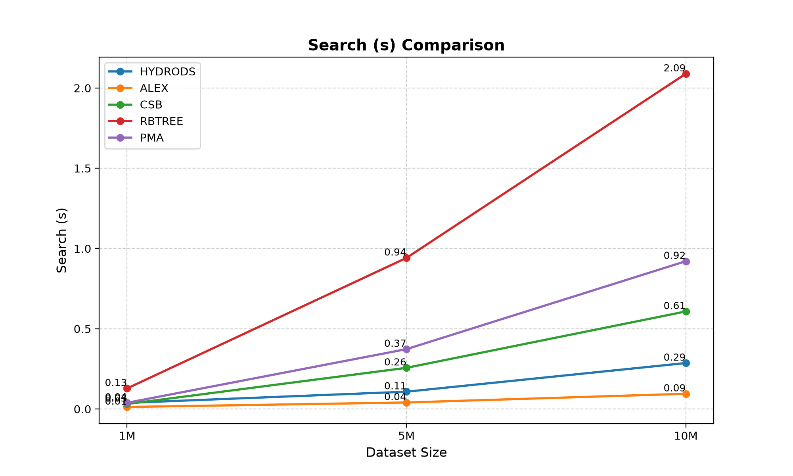
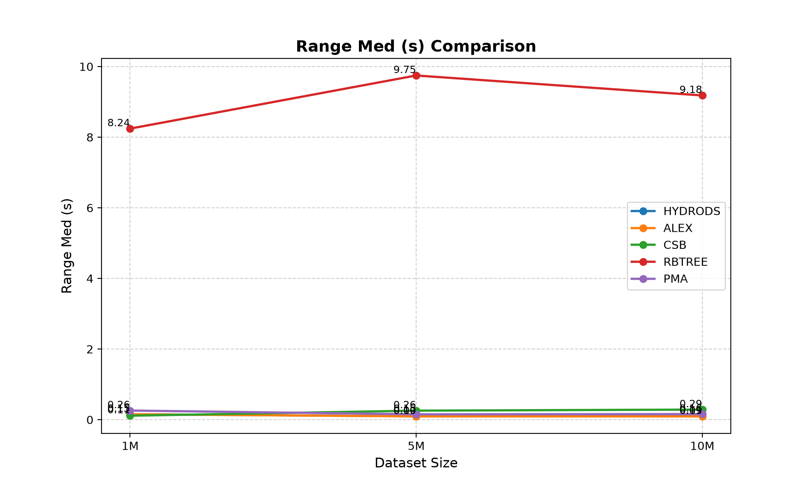
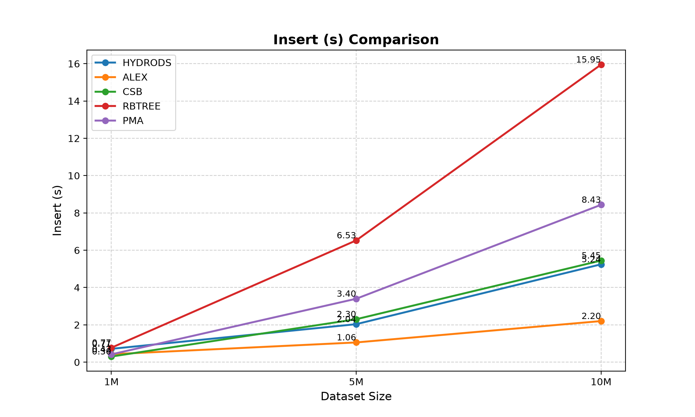

  <h1>HydroDS</h1>
  
<strong>A Cache-Conscious, Branchless Data Structure for Extreme Read Performance</strong>

HydroDS is a cache-conscious index structure designed to provide state-of-the-art point query and range scan latencies. Inspired by fluid dynamics, it relies on pressure-based element flowing across flat, cache-aligned memory blocks instead of traditional tree-based node splitting.

By replacing standard binary searches with **purely branchless execution (via `cmov` instructions)**, HydroDS practically eliminates CPU pipeline flushes caused by branch mispredictions, extracting maximum instructions-per-cycle (IPC) from modern deeply pipelined architectures.

---

## ⚡ Key Optimizations

- **Branchless Binary Search**: Point queries execute without branching, dropping search latencies by **~36%** over traditional search algorithms.
- **Cache-Line Aligned Buckets**: Intra-bucket operations use raw contiguous memory, ensuring optimal L1/L2 cache locality.
- **Multi-Threaded Scalability (Phase 2)**: An alternate concurrent variant (`hydrods_concurrent.hpp`) uses Optimistic Lock Coupling (OLC) to scale read operations almost linearly up to 16 threads.

---

## 📊 Performance & Evaluation

HydroDS was benchmarked against leading state-of-the-art structures including **ALEX (Learned Index)**, **CSB+Tree (TLX)**, **Red-Black Tree (std::set)**, and **PMA (Packed Memory Arrays)** up to 10M keys.

*Note: The complete theoretical methodology, architectural analysis, and hardware counter data (IPC, L1 Misses) are available in our primary research paper.*

### 🔍 1. Point Queries (Search Latency)
HydroDS achieves best-in-class read latency. The branchless design ensures that even as the dataset scales to 10M items, the CPU never stalls on pipeline flushes.

### 🏎️ 2. Range Scans
Unlike pointer-chasing structures (B+-Trees, RBTrees) which suffer from severe memory fragmentation, HydroDS scans flat, contiguous memory.

### ✍️ 3. Update (Insert) Latency
HydroDS avoids the extreme, latency-spiking array reallocations seen in standard PMAs and remains highly competitive with highly tuned B-Trees.

---
### 📈 Concurrent Scaling (Optimistic Lock Coupling)

> Thread scalability for 5 Million elements inserted and queried concurrently.

| Threads | Insert (s) | Search (s) | Range Sml (s) | Range Med (s) | Range Lrg (s) | Delete (s) | Memory (MB) |
|:--------|:-----------|:-----------|:--------------|:--------------|:--------------|:-----------|:------------|
| **1** | 7.5090 | 0.4975 | 0.0881 | 0.1986 | 0.0966 | 0.7702 | 33 |
| **2** | 7.2150 | 0.3369 | 0.0633 | 0.1730 | 0.0860 | 0.6437 | 30 |
| **4** | 7.8671 | 0.2561 | 0.0293 | 0.0629 | 0.0323 | 0.5671 | 31 |
| **8** | 8.3546 | 0.2533 | 0.0272 | 0.0402 | 0.0295 | 0.5296 | 30 |
| **16** | 8.5909 | 0.2677 | 0.0304 | 0.0373 | 0.0231 | 0.5367 | 27 |
| **32** | 8.8903 | 0.2472 | 0.0245 | 0.0321 | 0.0195 | 0.4522 | 29 |

---

  <i>Developed for Advanced Cache-Conscious Indexing Research.</i>

