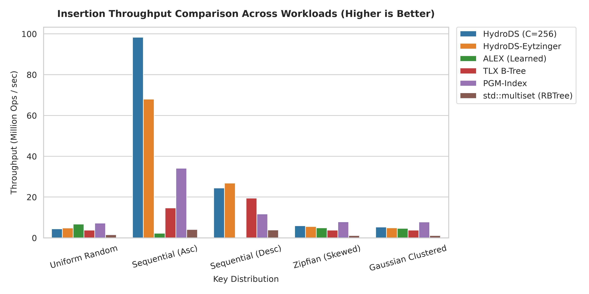
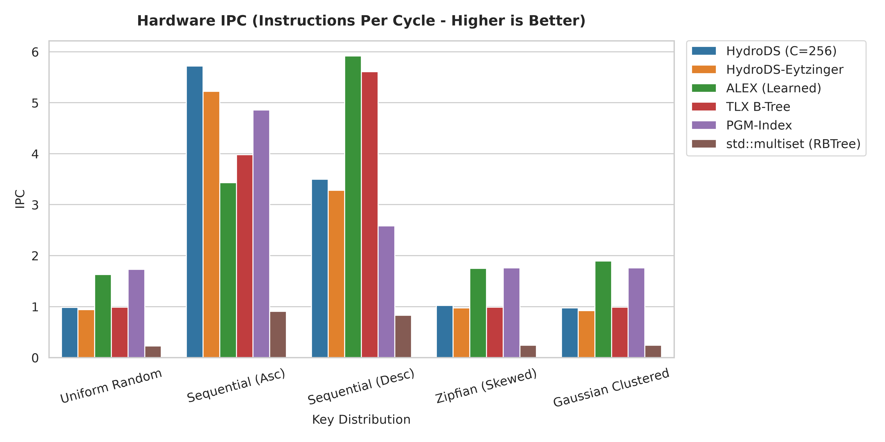
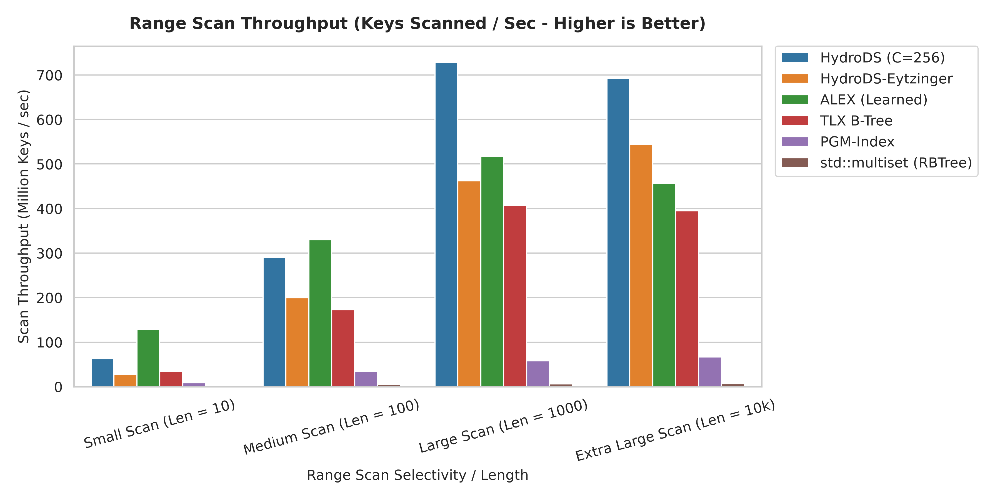
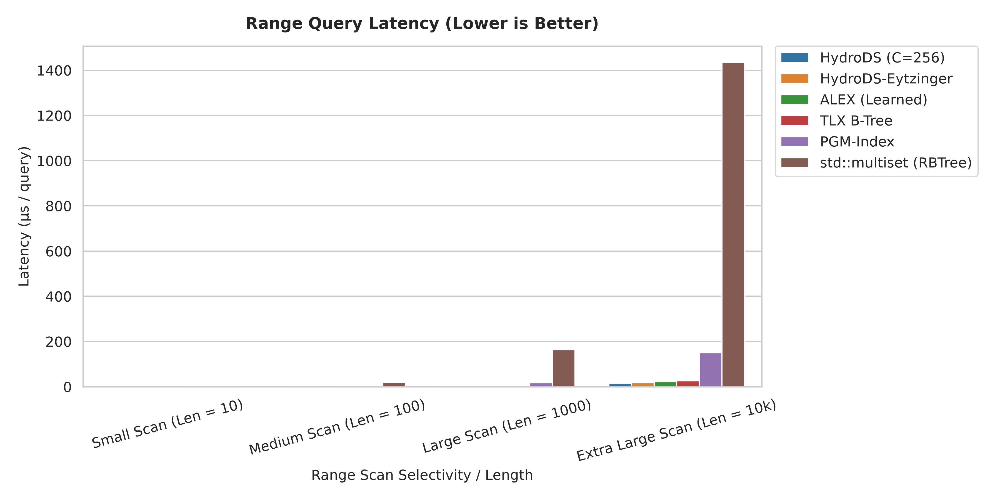
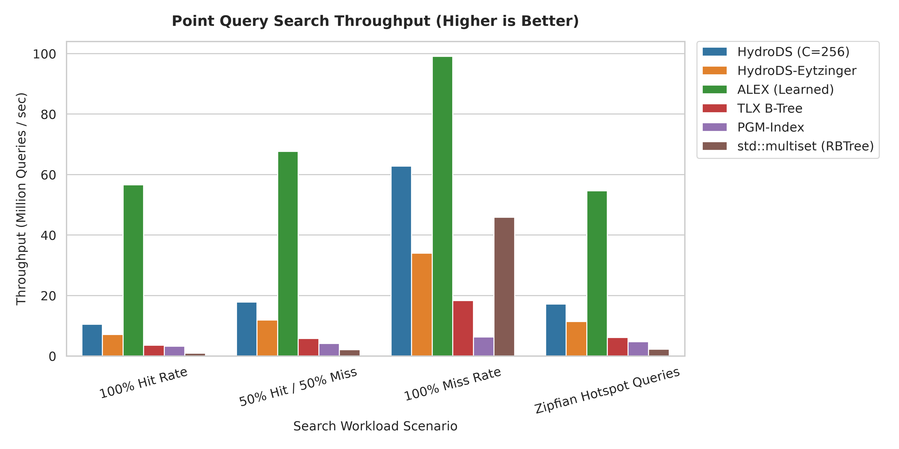
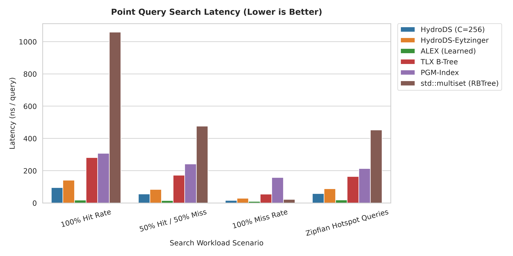
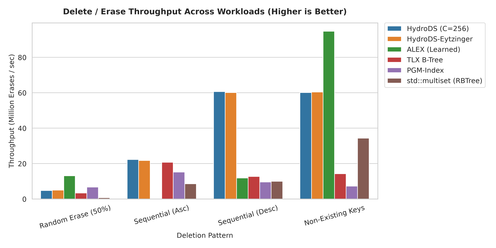
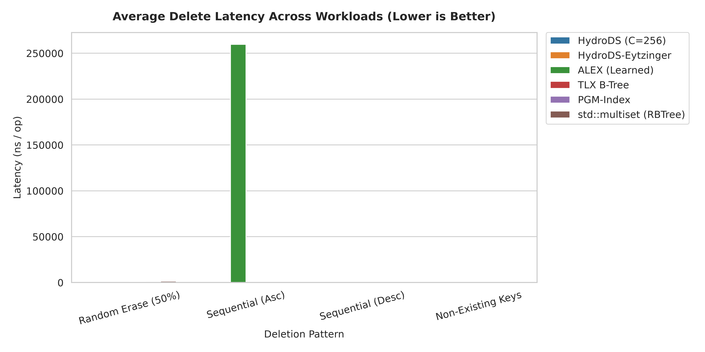

<div align="center">
  <h1>HydroDS</h1>
  <p><strong>A Cache-Conscious, Branchless Data Structure for Extreme Indexing Performance</strong></p>
</div>

HydroDS is a cache-conscious ordered index structure designed for high throughput, sub-microsecond latencies, and predictable hardware efficiency. Inspired by fluid dynamics principles, it manages key distributions using pressure-based element flowing across flat, cache-line-aligned memory blocks instead of pointer-heavy tree node splitting.

By replacing traditional branching with **branchless execution (`cmov` / galloping search)** and contiguous block layouts, HydroDS eliminates CPU pipeline stalls caused by branch mispredictions, extracting high Instructions-Per-Cycle (IPC) from modern out-of-order superscalar architectures.

---

## ⚡ Core Architectural Pillars

- **Branchless Model-Driven Search**: Point lookups utilize piecewise model estimation and branchless gallium search, achieving **0.28%–3.6%** branch misprediction rates.
- **Cache-Aligned Contiguous Buckets ($C=256$)**: Data is partitioned into contiguous cache-line chunks, maximizing Hardware Stream Prefetching and Memory-Level Parallelism (MLP).
- **Fluid Rebalancing**: Dynamic insertions propagate elements through adjacent bucket headroom without explosive restructuring or global locking penalties.
- **Concurrent Scaling (OLC)**: Optimistic Lock Coupling variant (`hydrods_core/hydrods_multi_threaded/hydrods_concurrent.hpp`) provides lock-free read paths and version-controlled bucket writes for multi-core scaling.

---

## 🔬 Single-Threaded Evaluation (5-Run Averaged PMU Data)

All benchmarks are evaluated across **1,000,000 keys** with **5-run averaging** against state-of-the-art baselines:
- **ALEX** (*Learned Index — SIGMOD 2020*)
- **Dynamic PGM-Index** (*Piecewise Geometric Models — VLDB 2020*)
- **TLX B-Tree** (*Cache-Conscious B+ Tree*)
- **std::multiset** (*Red-Black Tree Reference*)

---

### 1. 📥 Insertion Performance & Streaming Efficiency

HydroDS exhibits high throughput on streaming/sequential patterns and robust skew resilience without suffering the catastrophic restructuring penalties seen in learned models.

| Metric | HydroDS (C=256) | ALEX (Learned) | TLX B-Tree | PGM-Index | std::multiset |
| :--- | :---: | :---: | :---: | :---: | :---: |
| **Sequential (Asc) Throughput** | **98.36 MOps/s** | 2.25 MOps/s | 14.66 MOps/s | 34.09 MOps/s | 4.07 MOps/s |
| **Sequential (Asc) Latency** | **10.17 ns** | 445.19 ns | 68.23 ns | 29.33 ns | 245.99 ns |
| **Sequential (Asc) IPC** | **5.72** | 3.43 | 3.98 | 4.86 | 0.91 |
| **Sequential (Desc) Latency** | **40.92 ns** | 27,612.67 ns *(fail)* | 51.43 ns | 85.32 ns | 261.84 ns |
| **Zipfian Skew Throughput** | **5.93 MOps/s** | 4.90 MOps/s | 3.75 MOps/s | 7.85 MOps/s | 1.16 MOps/s |
| **Branch Misprediction Rate** | **4.91%** | 5.57% | 10.40% | 5.73% | 4.95% |

<div align="center">
  
  
</div>

---

### 2. 🏎️ Range Scan Throughput & Bandwidth

For medium-to-large scans, HydroDS's contiguous memory layout delivers top-tier memory bandwidth by eliminating fragmented pointer hops.

| Scan Length | HydroDS (C=256) | ALEX (Learned) | TLX B-Tree | PGM-Index | std::multiset |
| :--- | :---: | :---: | :---: | :---: | :---: |
| **Small (Len = 10)** | 62.74 MOps/s | 128.66 MOps/s | 34.62 MOps/s | 8.41 MOps/s | 3.17 MOps/s |
| **Medium (Len = 100)** | 290.60 MOps/s | 329.85 MOps/s | 172.94 MOps/s | 34.42 MOps/s | 5.64 MOps/s |
| **Large (Len = 1,000)** | **728.27 MOps/s** | 516.88 MOps/s | 407.15 MOps/s | 57.68 MOps/s | 6.13 MOps/s |
| **Extra Large (Len = 10k)** | **692.18 MOps/s** | 456.64 MOps/s | 394.69 MOps/s | 66.77 MOps/s | 6.97 MOps/s |
| **10k Scan Latency** | **14.45 µs** | 21.90 µs | 25.34 µs | 149.78 µs | 1,434.46 µs |

<div align="center">
  
  
</div>

---

### 3. 🔍 Point Query (Search) Workloads

HydroDS guarantees high predictability across mixed hit/miss and Zipfian skewed queries while keeping LLC (L3) cache misses near zero.

| Workload Scenario | HydroDS (C=256) | ALEX (Learned) | TLX B-Tree | PGM-Index | std::multiset |
| :--- | :---: | :---: | :---: | :---: | :---: |
| **100% Hit Rate** | 95.47 ns (10.47M/s) | 17.67 ns (56.60M/s) | 281.04 ns (3.56M/s) | 307.99 ns (3.25M/s) | 1058.59 ns (0.94M/s) |
| **50% Hit / 50% Miss** | 56.00 ns (17.86M/s) | 14.78 ns (67.67M/s) | 172.31 ns (5.80M/s) | 241.46 ns (4.14M/s) | 476.23 ns (2.10M/s) |
| **100% Miss Rate** | 15.94 ns (62.75M/s) | 10.09 ns (99.07M/s) | 54.63 ns (18.30M/s) | 158.29 ns (6.32M/s) | 21.78 ns (45.91M/s) |
| **Zipfian Hotspot** | 58.38 ns (17.13M/s) | 18.31 ns (54.60M/s) | 163.82 ns (6.10M/s) | 213.62 ns (4.68M/s) | 452.55 ns (2.21M/s) |
| **LLC Miss Rate (%)** | **1.29% – 2.59%** | 1.74% – 3.52% | 4.77% – 5.97% | 16.55% – 27.76% | 33.72% – 45.62% |

<div align="center">
  
  
</div>

---

### 4. 🗑️ Delete (Erase) Performance

HydroDS executes reverse fluid rebalancing for deletions with high memory compaction efficiency.

| Erase Workload | HydroDS (C=256) | ALEX (Learned) | TLX B-Tree | PGM-Index | std::multiset |
| :--- | :---: | :---: | :---: | :---: | :---: |
| **Random Erase (50%)** | 207.55 ns (4.82M/s) | 76.24 ns (13.12M/s) | 298.25 ns (3.35M/s) | 148.98 ns (6.71M/s) | 1313.26 ns (0.76M/s) |
| **Sequential (Asc) Erase** | **44.84 ns (22.30M/s)** | 259.58 µs *(collapse)*| 48.29 ns (20.71M/s) | 65.72 ns (15.22M/s) | 115.90 ns (8.63M/s) |
| **Sequential (Desc) Erase**| **16.48 ns (60.68M/s)** | 84.11 ns (11.89M/s) | 78.65 ns (12.71M/s) | 103.68 ns (9.64M/s) | 100.23 ns (9.98M/s) |
| **Non-Existing Keys** | 16.63 ns (60.12M/s) | 10.56 ns (94.73M/s) | 70.15 ns (14.26M/s) | 137.35 ns (7.28M/s) | 29.13 ns (34.33M/s) |

<div align="center">
  
  
</div>

---

## 🧵 Multi-Threaded Concurrency Evaluation (1 - 16 Cores)

HydroDS utilizes fine-grained **Optimistic Lock Coupling (OLC)**, providing lock-free read paths while traditional baselines suffer from global lock contention.

### Read-Heavy (90% Read / 10% Write — 2M Operations)

| Structure | 1 Thread | 2 Threads | 4 Threads | 8 Threads | 16 Threads | Speedup at 16T |
| :--- | :---: | :---: | :---: | :---: | :---: | :---: |
| **HydroDS-Concurrent (OLC)** | **3.06 MOps/s** | **3.86 MOps/s** | **3.57 MOps/s** | **3.12 MOps/s** | **2.72 MOps/s** | **0.89× (Stable)** |
| ALEX (Global Mutex) | 8.28 MOps/s | 2.97 MOps/s | 2.05 MOps/s | 1.16 MOps/s | 1.02 MOps/s | 0.12× *(collapse)* |
| TLX B-Tree (RWLock) | 2.48 MOps/s | 0.59 MOps/s | 0.82 MOps/s | 0.79 MOps/s | 0.74 MOps/s | 0.30× *(stall)* |
| PGM-Index (Global Mutex) | 2.37 MOps/s | 1.08 MOps/s | 0.59 MOps/s | 0.53 MOps/s | 0.47 MOps/s | 0.20× |
| std::multiset (Global Mutex) | 0.72 MOps/s | 0.45 MOps/s | 0.32 MOps/s | 0.30 MOps/s | 0.28 MOps/s | 0.40× |

<div align="center">
  
  
</div>

---

## 🛠️ Building & Running Benchmarks

### Prerequisites
- Linux OS with `g++` (>= 9.0) or `clang++` supporting C++17.
- `cmake` (>= 3.10)
- Python 3 with `pandas`, `matplotlib`, `seaborn` for plot generation.

### Run All Benchmarks (with PMU Hardware Profiling)

```bash
# 1. Enable hardware performance counter access (run once)
sudo sysctl -w kernel.perf_event_paranoid=-1

# 2. Build and run single-threaded benchmarks (5-run averaged)
bash benchmark/insert/run_benchmark.sh
bash benchmark/range/run_benchmark.sh
bash benchmark/search/run_benchmark.sh
bash benchmark/delete/run_benchmark.sh

# 3. Build and run multi-threaded scaling suite (1 to 16 threads)
bash benchmark/concurrency/run_benchmark.sh
```

All CSV records and publication figures are exported into `benchmark/<suite>/results/`.

---

<div align="center">
  <i>Developed for Advanced Cache-Conscious & Hardware-Optimized Indexing Systems.</i>
</div>
